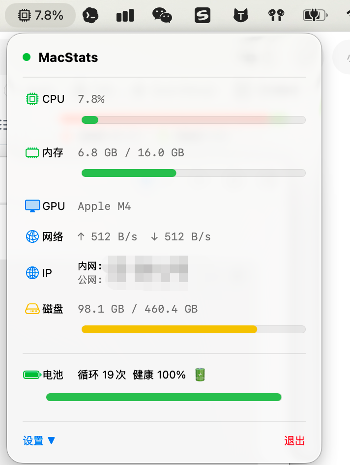

# MacStats  /  MacStats 菜单栏系统监控

[English](#english) | [中文](#中文)

---

## English

A lightweight macOS menu bar system monitor — CPU, memory, GPU, network, disk, battery all in one place.

<picture>
  <source media="(prefers-color-scheme: dark)" srcset="screenshot.png">
  
</picture>

### Features

- **Real-time CPU usage** with progress bar
- **Memory usage** with progress bar
- **GPU model** display
- **Network speed** — real-time upload & download
- **IP address** — local & public
- **Disk** free space & usage
- **Battery** cycle count, health & charging status

### Requirements

- macOS 14.0+
- Xcode 16+ (if building from source)
- No developer account required

### Build from Source

```bash
# Using Xcode (recommended)
xcodegen generate
xcodebuild -project MacStats.xcodeproj -scheme MacStats -configuration Release build

# Or using SwiftPM
swift build -c release
cp -R .build/release/MacStats.app /Applications/
```

### Usage

| Action | Description |
|---|---|
| Click menu bar CPU icon | Toggle panel |
| Click "Settings ▼" | Expand options (show CPU %) |
| Click "Quit" | Exit the app |

Data refreshes every **2 seconds**; public IP refreshes every **2 minutes**.

### Tech Stack

- **SwiftUI** — Menu bar interface (`MenuBarExtra` on macOS 14+)
- **CoreGraphics** — Custom app icon (green CPU chip)
- **IOKit** — Battery cycle count, health, hardware data
- **Mach API** — CPU & memory usage
- **ifaddrs** — Local IP & network speed
- **URLSession** — Public IP via api.ipify.org
- **pmset** — Battery presence check

### Data Sources

- **CPU**: `host_statistics()` (Mach)
- **Memory**: `host_statistics64()` (Mach)
- **GPU**: `Metal` / `MTLCreateSystemDefaultDevice()`
- **Network**: `getifaddrs()` + delta calculation
- **IP**: `getnameinfo()` (local), `api.ipify.org` (public)
- **Disk**: `FileManager.attributesOfFileSystem()`
- **Battery**: IOKit `AppleSmartBattery` service + `pmset -g batt`

---

## 中文

macOS 菜单栏系统监控工具 — CPU、内存、GPU、网络、磁盘、电池，一览无余。

<picture>
  <source media="(prefers-color-scheme: dark)" srcset="screenshot.png">
  
</picture>

### 功能

- **CPU 实时使用率** + 进度条
- **内存用量 / 总量** + 进度条
- **GPU 型号**显示
- **网络上行/下行**实时速度
- **内网 IP + 公网 IP**
- **磁盘**剩余容量 + 使用率
- **电池**循环次数 + 健康度 + 充电状态

### 环境要求

- macOS 14.0+
- Xcode 16+ (如需自行编译)
- 无需开发者账号即可运行

### 从源码构建

```bash
# 使用 Xcode (推荐)
xcodegen generate
xcodebuild -project MacStats.xcodeproj -scheme MacStats -configuration Release build

# 或使用 SwiftPM
swift build -c release
cp -R .build/release/MacStats.app /Applications/
```

### 使用说明

| 操作 | 说明 |
|---|---|
| 点击菜单栏 CPU 图标 | 展开 / 收起面板 |
| 点击「设置 ▼」 | 展开选项（显示 CPU 百分比等） |
| 点击「退出」 | 关闭应用 |

所有数据每 **2 秒** 自动刷新一次，公网 IP 每 **2 分钟** 刷新一次。

### 技术栈

- **SwiftUI** — 菜单栏界面 (`MenuBarExtra` on macOS 14+)
- **CoreGraphics** — 自定义 app 图标（绿色 CPU 芯片）
- **IOKit** — 读取电池循环次数、健康度等硬件数据
- **Mach API** — CPU、内存占用率
- **ifaddrs** — 内网 IP、网络速度
- **URLSession** — 公网 IP (api.ipify.org)
- **pmset** — 电池存在检测

### 数据来源

- **CPU**: `host_statistics()` (Mach)
- **Memory**: `host_statistics64()` (Mach)
- **GPU**: `Metal` / `MTLCreateSystemDefaultDevice()`
- **Network**: `getifaddrs()` + delta calculation
- **IP**: `getnameinfo()` (local), `api.ipify.org` (public)
- **Disk**: `FileManager.attributesOfFileSystem()`
- **Battery**: IOKit `AppleSmartBattery` service + `pmset -g batt`

---

## Project Structure / 项目结构

```
MacStats/
├── Sources/
│   └── MacStats/
│       ├── MacStatsApp.swift    # App entry + UI
│       ├── SystemMonitor.swift  # System data collection
│       ├── Info.plist
│       └── Resources/
│           └── MacStats.icns    # App icon
├── project.yml                  # xcodegen config
├── Package.swift                # SwiftPM config
└── Scripts/
    ├── install.sh
    └── launch.sh
```

## License / 许可

MIT  —  Copyright © 2026 MaoYF
